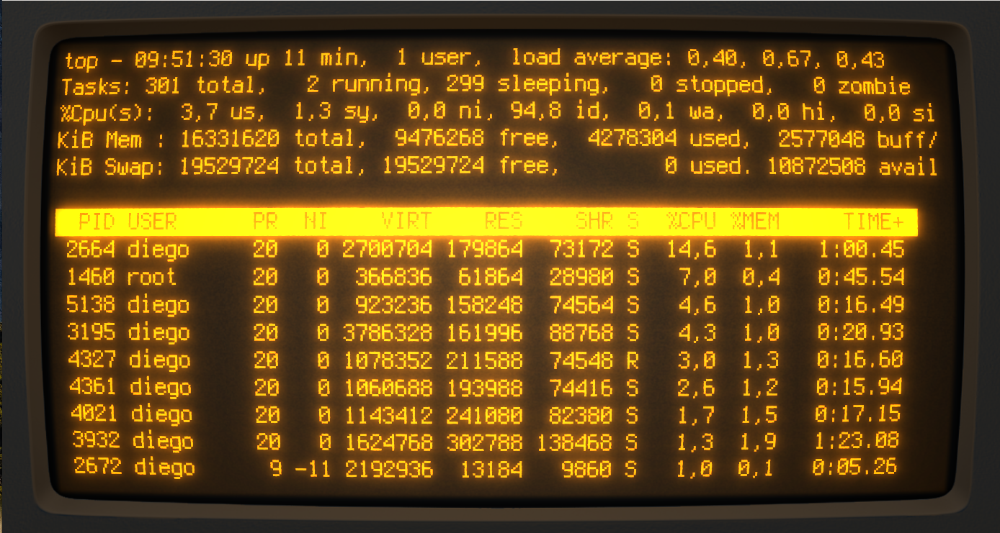
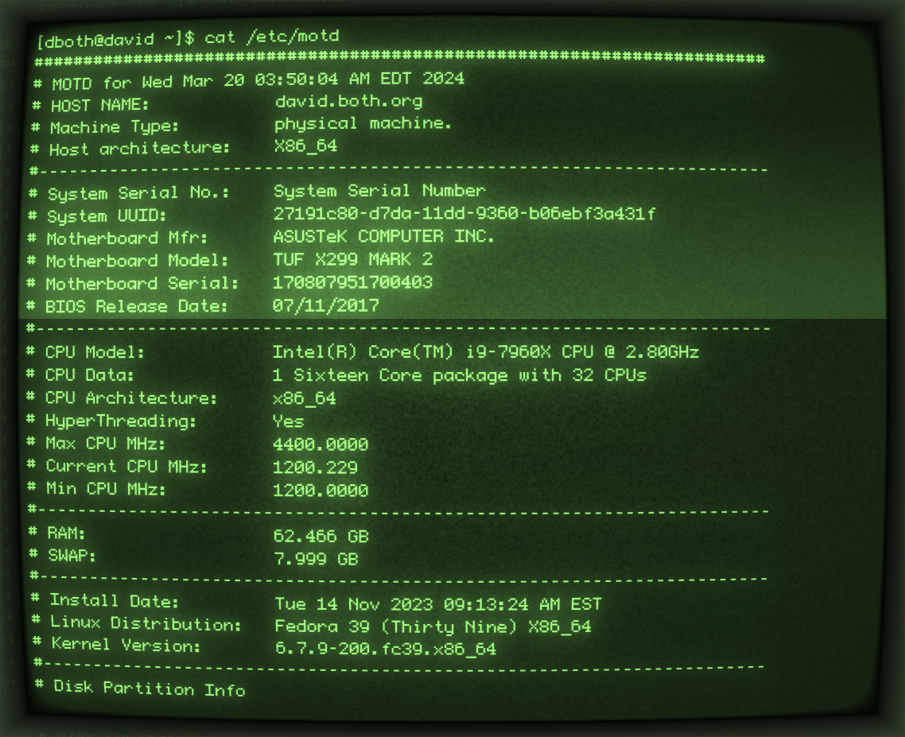
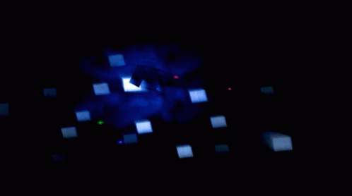
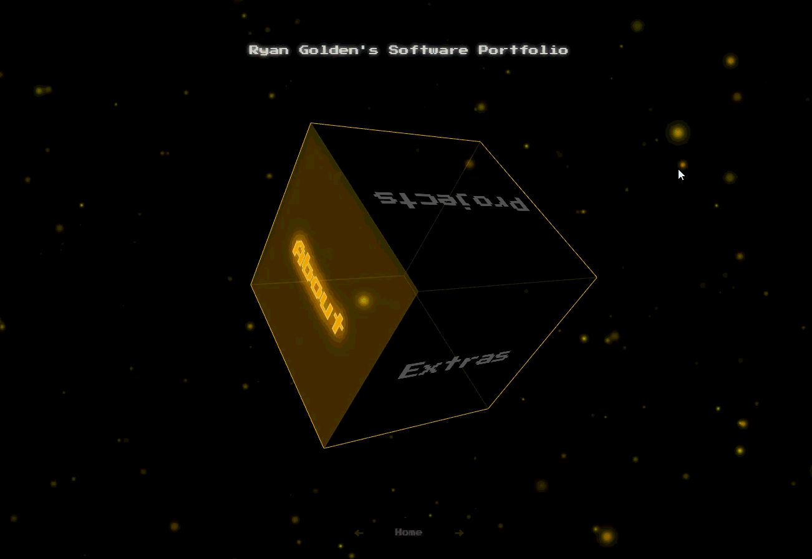

# Ryan Golden — Software Portfolio

This site is inspired by the eerie ambiance of the startup interfaces of the **Nintendo GameCube and PlayStation 2** as well as old school amber and green terminals, combining a rotating 3D cube, animated particles, retro UI elements, sound effects, and customizable themes.

## Amber + Green Terminal

<table>
  <tr>
    <td align="center">
      
       
    </td>
    <td align="center">
      
       
    </td>
  </tr>
</table>

## Ps2 + Gamecube

<table>
  <tr>
    <td align="center">
      
       
    </td>
    <td align="center">
      
       
    </td>
  </tr>
</table>

## Features

* Interactive Three.js portfolio cube
* Mouse, touch, and keyboard navigation
* About, Projects, Resume, Contact, Extras, and Settings sections
* Responsive desktop and mobile layouts
* Light and dark modes
* Custom UI colors and rainbow theme
* Background music and sound controls
* Persistent settings using `localStorage`
* Animated particle background
* Project showcases with images, demos, and repository links

## Live Site

**https://ryan-golden.com**
 
 

## Author

**Ryan Golden**

* LinkedIn: **https://linkedin.com/in/ryangoldencs**